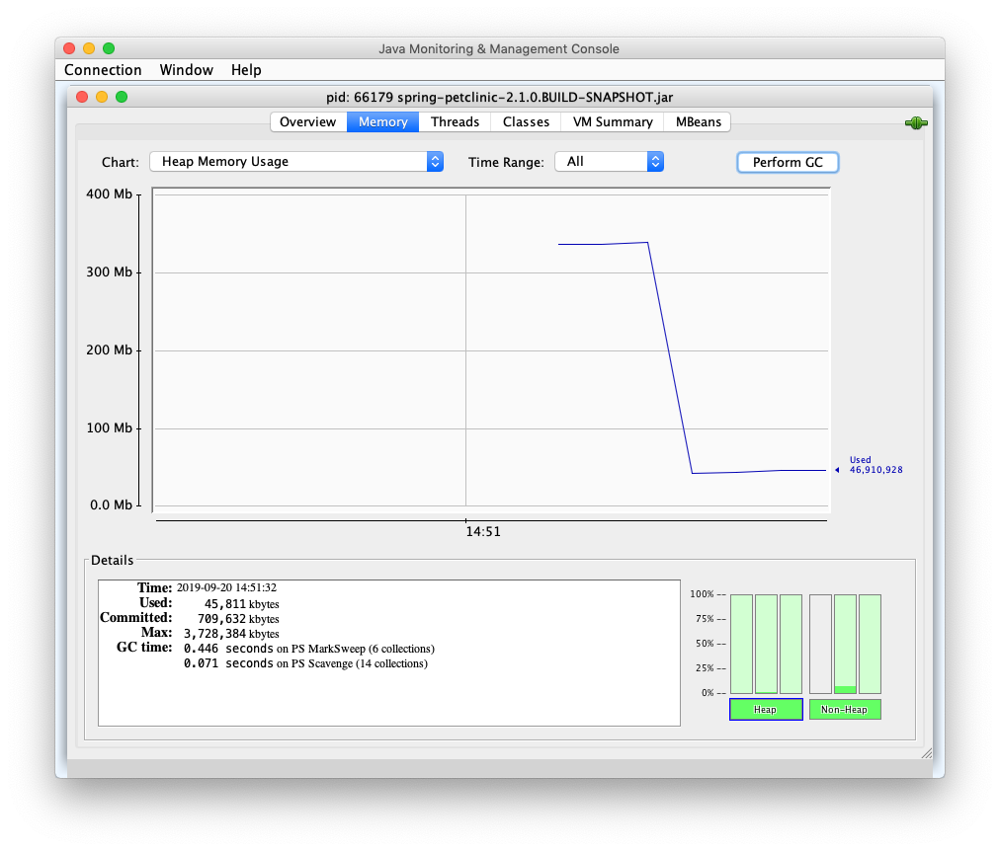

# Introduction

The aim of this repo is to measure some features of an Spring Boot application and its Docker image. 
Instead of creating a new Spring Boot demo from scratch, it is based on 
[Spring PetClinic](https://github.com/spring-projects/spring-petclinic).

#  Size

## Spring Boot artifact's size

Build PetClinic application:

```
git clone https://github.com/wearearima/spring-boot-docker-size.git
cd spring-boot-docker-size
./mvnw clean package
```

Measure the jar files:

```
ls -lh target/*.jar*
```

Result:

```
-rw-r--r--  1 inigotelleria  staff    43M Sep  2 17:05 target/spring-petclinic-2.1.0.BUILD-SNAPSHOT.jar
-rw-r--r--  1 inigotelleria  staff   371K Sep  2 17:05 target/spring-petclinic-2.1.0.BUILD-SNAPSHOT.jar.original
```

The file named `spring-petclinic-2.1.0.BUILD-SNAPSHOT` is the resulting fat jar because it includes
PetClinic's code and its dependencies. The other file, suffixed `.original`, is just PetClinic's code
without its dependencies. The result is that our code size is `371KB` and the dependencies' `43MB`. 

## Docker image's size

Build PetClinic's Docker image:

```
./mvnw dockerfile:build
```

Measure the image size:

```
docker image ls | grep spring-petclinic
```

Result:

```
org.springframework.samples/spring-petclinic                     latest                  f64e33676fba        35 seconds ago      150MB
```

We can see that size of the artifact has increased from `43MB` to `150MB`. This is mainly because the 
Docker image includes the JDK and Linux images. Run this command to check it:

```
docker image history org.springframework.samples/spring-petclinic
```

The result shows the different layers added to the Docker image:

```
Inigos-MacBook-Pro:spring-petclinic inigo$ docker image history org.springframework.samples/spring-petclinic
IMAGE               CREATED              CREATED BY                                      SIZE                COMMENT
f64e33676fba        About a minute ago   /bin/sh -c #(nop)  CMD ["/bin/sh" "-c" "/usr…   0B                  
514ea9d949f4        About a minute ago   /bin/sh -c #(nop)  EXPOSE 8080                  0B                  
0c5656961ef9        About a minute ago   /bin/sh -c #(nop) COPY file:f694d1e78b9e3890…   44.9MB              
5a0aa4f6ec7b        About a minute ago   /bin/sh -c #(nop)  ARG JAR_FILE                 0B                  
b055dd6e77e1        About a minute ago   /bin/sh -c #(nop)  VOLUME [/tmp]                0B                  
a3562aa0b991        3 months ago         /bin/sh -c set -x  && apk add --no-cache   o…   99.3MB              
<missing>           3 months ago         /bin/sh -c #(nop)  ENV JAVA_ALPINE_VERSION=8…   0B                  
<missing>           3 months ago         /bin/sh -c #(nop)  ENV JAVA_VERSION=8u212       0B                  
<missing>           3 months ago         /bin/sh -c #(nop)  ENV PATH=/usr/local/sbin:…   0B                  
<missing>           3 months ago         /bin/sh -c #(nop)  ENV JAVA_HOME=/usr/lib/jv…   0B                  
<missing>           3 months ago         /bin/sh -c {   echo '#!/bin/sh';   echo 'set…   87B                 
<missing>           3 months ago         /bin/sh -c #(nop)  ENV LANG=C.UTF-8             0B                  
<missing>           3 months ago         /bin/sh -c #(nop)  CMD ["/bin/sh"]              0B                  
<missing>           3 months ago         /bin/sh -c #(nop) ADD file:a86aea1f3a7d68f6a…   5.53MB
```

The `5.53MB` image is the Alpine Linux image and the `99.3MB` image is the JDK8 image. The sum of all them results in an image of
`150MB` which includes Linux OS, JDK8, PetClinic's code and dependencies' jar.  

> Different Linux image comparison at https://github.com/gliderlabs/docker-alpine#why 

# Startup time

Run PetClinic application with this command:

```
java -jar target/spring-petclinic-2.1.0.BUILD-SNAPSHOT.jar
```

The applications starts en `5,54 seconds` using AdoptOpenJDK 1.8.0_222-b10:

```
Started PetClinicApplication in 5.54 seconds (JVM running for 5.902)
```

# Memory usage

## Spring Boot artifact's memory usage

After navigating through the application to make sure all beans are loaded, open `JConsole` or other profiler such as 
YourKit. Measure the heap after executing Garbage Collector (GC). 



With no load the application's heap consumption is around `60MB` . However, the memory consumption is bigger than just the
heap, so let's measure it using ``ps`` command:

```
Inigos-MacBook-Pro:spring-boot-docker-size inigo$ ps aux 14526
USER    PID  %CPU %MEM      VSZ    RSS   TT  STAT STARTED      TIME COMMAND
inigo   14526   0.0  4.0 10241740 669648 s004  S+    4:25PM   0:33.05 /usr/bin/java -jar target/spring-petclinic-2.1.0.BUILD-SNAPSHOT.jar```
```

We can see that PetClinic's process actually is using almost `650MB` of memory.  

## Docker image's memory usage

Run a PetClinic container with this command:

```
docker run -p 8080:8080 org.springframework.samples/spring-petclinic
```

Executing ``docker stats`` we can find out how much memory is using the container with no load:

```
CONTAINER ID        NAME                CPU %               MEM USAGE / LIMIT     MEM %               NET I/O             BLOCK I/O           PIDS
970acf08cdb0        jovial_khayyam      0.48%               586.3MiB / 5.818GiB   9.84%               2.7kB / 8.74kB      164kB / 0B          33
```

So, the container uses ``586MB`` of memory. 

> Interesting resource about measuring Spring Boot: https://spring.io/blog/2015/12/10/spring-boot-memory-performance

# Summary

| Feature                                           |                   |
| ------------------------------------------------- | ----------------- |
| Spring Boot App disk usage                        | 43M               |
| Spring Boot App disk usage (without dependencies) | 371KB             |
| Docker Container disk usage                       | 150MB             |
| Spring Boot App startup time                      | 5,54 seconds      |
| Spring Boot App heap consumption                  | 60MB              |
| Spring Boot App memory usage                      | 650MB             |
| Docker Container memory usage                     | 586MB             |

# Credits

Original PetClinic by https://www.spring.io

Docker configuration by https://www.arima.eu


