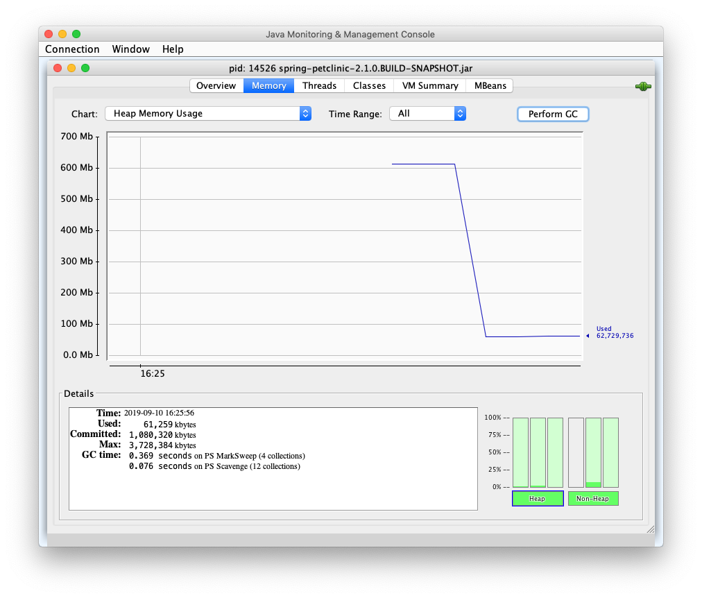

# Introduction

The aim of this repo is to measure the size of an spring boot application and its Docker size. 
Instead of creating a new spring boot demo from scratch, we have based on 
[Spring PetClinic](https://github.com/spring-projects/spring-petclinic).

#  Size

## Spring Boot artifact's size

Build PetClinic application:

```
    git clone https://github.com/wearearima/spring-boot-docker-image-size.git
    cd spring-petclinic
    ./mvnw clean package
```

Measure the jar files:

```
    ls -lh target/*.jar*
```

Result:

```
-rw-r--r--  1 inigo  staff    37M May  8 07:56 target/spring-petclinic-2.0.0.BUILD-SNAPSHOT.jar
-rw-r--r--  1 inigo  staff   372K May  8 07:56 target/spring-petclinic-2.0.0.BUILD-SNAPSHOT.jar.original
```

The file named `spring-petclinic-2.0.0.BUILD-SNAPSHOT` is the resulting fat jar because it includes
PetClinic's code and its dependencies. The other file, suffixed `.original`, is just PetClinic's code
without its dependencies. The result is that our code size is `372KB` and the dependencies' `37MB`. 

## Docker image's size

Build PetClinic's Docker image:

```
    ./mvnw dockerfile:build
```

Measure the image size:

```
    docker image ls | grep spring-petclinic
```

Result:

```
org.springframework.samples/spring-petclinic   latest              315d50e3a3c9        2 minutes ago       140MB
```

We can see that size of the artifact has increased from 37MB to 140MB. This is mainly because the 
Docker image includes the JDK and Linux images. Run this command to check it:

```
    docker image history org.springframework.samples/spring-petclinic
```

The result shows the different layers added to the Docker image:

```
Inigos-MacBook-Pro:spring-petclinic inigo$ docker image history org.springframework.samples/spring-petclinic
IMAGE               CREATED             CREATED BY                                      SIZE                COMMENT
315d50e3a3c9        8 minutes ago       /bin/sh -c #(nop)  CMD ["/bin/sh" "-c" "/usr…   0B                  
e140a42c4afb        8 minutes ago       /bin/sh -c #(nop)  EXPOSE 8080                  0B                  
e0adf50171a8        8 minutes ago       /bin/sh -c #(nop) COPY file:f7fb05966b1ffa8d…   38.3MB              
54679c3ebdc2        8 minutes ago       /bin/sh -c #(nop)  ARG JAR_FILE                 0B                  
4528db8c5c97        8 minutes ago       /bin/sh -c #(nop)  VOLUME [/tmp]                0B                  
224765a6bdbe        3 months ago        /bin/sh -c set -x  && apk add --no-cache   o…   97.4MB              
<missing>           3 months ago        /bin/sh -c #(nop)  ENV JAVA_ALPINE_VERSION=8…   0B                  
<missing>           3 months ago        /bin/sh -c #(nop)  ENV JAVA_VERSION=8u151       0B                  
<missing>           3 months ago        /bin/sh -c #(nop)  ENV PATH=/usr/local/sbin:…   0B                  
<missing>           3 months ago        /bin/sh -c #(nop)  ENV JAVA_HOME=/usr/lib/jv…   0B                  
<missing>           3 months ago        /bin/sh -c {   echo '#!/bin/sh';   echo 'set…   87B                 
<missing>           3 months ago        /bin/sh -c #(nop)  ENV LANG=C.UTF-8             0B                  
<missing>           3 months ago        /bin/sh -c #(nop)  CMD ["/bin/sh"]              0B                  
<missing>           3 months ago        /bin/sh -c #(nop) ADD file:093f0723fa46f6cdb…   4.15MB
```

The `4.15MB` image is the Alpine Linux image and the `97.4MB` image is the JDK8 image (it 
includes the previous Alpine Linux image as well). The sum of all them results in an image of
`140MB` which includes Linux OS, JDK8, PetClinic's code and dependencies' jar.  

> Different Linux image comparison at https://github.com/gliderlabs/docker-alpine#why 

# Memory usage

## Spring Boot artifact's memory usage

Run PetClinic application with this command:

```
java -jar target/spring-petclinic-2.0.0.BUILD-SNAPSHOT.jar
```

Open `JConsole` (or other profiler such as YourKit) and measure the heap after executing Garbage Collector (GC). The 
result is this:



With no load the application's heap consumption is around 60MB. However, the memory consumption is bigger than just the
heap, so let's measure it using ``ps`` command:

```
Inigos-MacBook-Pro:spring-boot-docker-size inigo$ ps aux 43820
USER    PID  %CPU %MEM      VSZ    RSS   TT  STAT STARTED      TIME COMMAND
inigo 43820   0.2  4.8 10285672 801844 s001  S+    6:00PM   0:50.76 /usr/bin/java -jar target/spring-petclinic-2.0.0.BUILD
```

We can see that PetClinic's process actually is using almost `80MB of memory.  

## Docker image's memory usage

Run a PetClinic container with this command:

```
docker run org.springframework.samples/spring-petclinic
```

Executing ``docker stats`` we can find out how much memory is using the container with no load:

```
CONTAINER ID        NAME                CPU %               MEM USAGE / LIMIT   MEM %               NET I/O             BLOCK I/O           PIDS
4fd5cd5f644d        youthful_feynman    0.26%               521MiB / 5.818GiB   8.74%               1.72kB / 0B         25.3MB / 0B         34
```

So, the container uses ``521MB`` of memory. 

# Credits

Original PetClinic by https://www.s`pring.io

Docker configuration by https://www.arima.eu


